# Maganghub Auto-Presence

> ⚠️ **Educational Purpose Only**  
> This project is created for learning purposes to demonstrate Go programming, browser automation with Playwright, CRON scheduling, and API integration. Use responsibly and in accordance with applicable terms of service.

Automated attendance submission for Maganghub MONEV (Monitoring & Evaluasi) system.

## Features

- 🕐 **Scheduled Attendance** - Auto-submit attendance based on CRON schedule
- 📝 **Daily Log Rotation** - Different logs for each day of the week
- 🔐 **Session Caching** - Reuse cookies to avoid re-login
- ✅ **Startup Validation** - Verify credentials and log length at startup
- 🖥️ **Headless Mode** - Run browser in background

## Flow Diagram

```mermaid
flowchart TD
    A[🚀 Start Application] --> B[Load .env Config]
    B --> C[Validate daily_logs.json]
    C --> D{Fields >= 100 chars?}
    D -->|No| E[⚠️ Show Warnings]
    D -->|Yes| F[✅ Validation OK]
    E --> F
    F --> G[🔐 Verify Login]
    G --> H{Login Success?}
    H -->|No| I[❌ Exit]
    H -->|Yes| J[Start CRON Scheduler]
    J --> K[⏰ Wait for Schedule]
    
    K --> L[🔄 Run Attendance Job]
    L --> M{Has Cached Cookies?}
    M -->|Yes| N[Try API with Cookies]
    M -->|No| P[🌐 Login via Browser]
    N --> O{Cookies Valid?}
    O -->|Yes| Q[✅ Use Cached Session]
    O -->|No| P
    P --> R[💾 Save New Cookies]
    R --> Q
    Q --> S{Already Attended?}
    S -->|Yes| T[Skip Submission]
    S -->|No| U[📤 Submit Attendance]
    U --> V[✅ Done]
    T --> V
    V --> K
```



## Setup

### 1. Install Dependencies

```bash
go mod download
```

### 2. Install Playwright Browser

```bash
go run github.com/playwright-community/playwright-go/cmd/playwright install chromium
```

### 3. Configure Environment

Create `.env` file:

```env
MAGANGHUB_USERNAME=your_email@example.com
MAGANGHUB_PASSWORD=your_password

# CRON Schedule (default: 8AM daily)
CRON_SCHEDULE=0 8 * * *

# Browser headless mode (true/false)
HEADLESS=true
```

### 4. Configure Daily Logs

Edit `daily_logs.json` to customize your daily attendance logs. Each field must have **at least 100 characters**.

```json
[
  {
    "day": "Monday",
    "activity_log": "Your Monday activities...",
    "lesson_learned": "What you learned...",
    "obstacles": "Any obstacles faced..."
  }
]
```

## Usage

### Run

```bash
go run ./cmd/server
```

### Build & Run

```bash
go build -o maganghub-autopresence ./cmd/server
./maganghub-autopresence
```

## Project Structure

```
├── cmd/server/main.go           # Entry point
├── internal/
│   ├── api/                     # API client
│   ├── browser/                 # Browser automation
│   ├── config/                  # Configuration loader
│   ├── cookie_manager/          # Cookie persistence
│   └── schedule/                # Scheduler & daily logs
├── daily_logs.json              # Daily log templates
└── .env                         # Environment variables
```

## CRON Schedule Examples

| Schedule | Description |
|----------|-------------|
| `0 8 * * *` | Every day at 8 AM |
| `0 8 * * 1-5` | Weekdays at 8 AM |
| `30 7 * * *` | Every day at 7:30 AM |

## License

MIT
